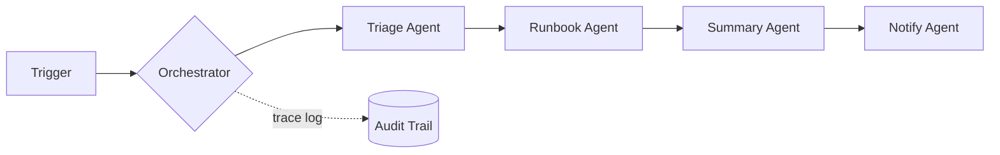

# 🐝 Swarmwatch — Ten-Agent Orchestration Lab

  

> 💡 **Ten single-purpose agents, one router — every decision traced, nothing is a black box.**



---

Ten purpose-built agents, unified behind one router/orchestrator, built while working through *Build 10 AI Agents with Claude Code & Claude Cowork [2026]* — rebuilt around a single theme (a small platform team's daily workflows) instead of ten disconnected demos.

## 🧩 Sub-projects
- **`agents/`** — ten agents, each with one job (e.g. triage, runbook lookup, summary, notify, status-check…), sharing one input/output contract
- **`contract/`** — the shared agent interface schema that makes all ten interchangeable and composable
- **`evals/`** — a short test per agent proving it does its one job reliably

## 🚀 Master Project
A router that composes the ten agents into multi-step workflows — e.g. `incident → triage agent → runbook agent → summary agent → notify agent` — with a trace log per run so every decision is auditable.

## ⚡ Quickstart
```bash
git clone <your-fork-url> && cd swarmwatch
./scripts/setup.sh
./scripts/dev.sh
```

## 🗺️ Roadmap
- [ ] Shared agent contract defined
- [ ] All 10 agents implemented against the contract
- [ ] Per-agent eval passing
- [ ] Orchestrator composing at least 2 multi-step workflows
- [ ] Run trace log + a simple viewer

## 📈 At 10x Scale, I'd
Make the orchestrator's step graph configurable (not hardcoded), add per-agent timeouts and fallback agents, and move trace logs to structured storage with a query interface instead of flat files.

## 🔍 Originality vs. the Course
The course builds 10 standalone agents; this repo unifies them under one theme, one contract, and one orchestrator — the multi-agent system design a course's ten separate demos don't show.

## 📄 License
MIT – see `LICENSE`.
